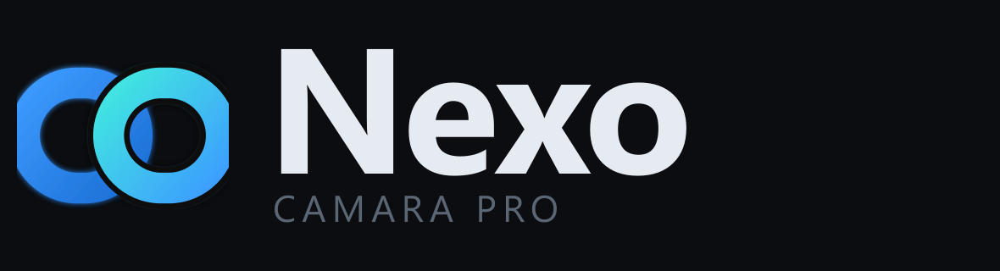

<p align="center">
  
</p>

<p align="center">
  <b>Convierte tu iPhone 17 en la camara profesional de tu PC, por cable USB-C.</b><br>
  Aplicacion de escritorio para Windows + app nativa para iOS. Sin navegador, sin marcas de agua, sin coste.
</p>

---

## Que es

Nexo son **dos aplicaciones nativas** que trabajan juntas:

- **Nexo Desktop** (Windows) — el estudio: recibe el video del iPhone, lo corrige
  (exposicion, color, nitidez, encuadre) y lo entrega como camara a TikTok, OBS,
  YouTube, Zoom o Discord.
- **Nexo Cam** (iOS 26) — la camara: captura con cualquier lente del iPhone 17
  (ultra gran angular, principal 48 MP, frontal), con control de ISO, obturador y
  foco, y lo envia por el cable.

A diferencia del enfoque por navegador, el cable USB-C funciona **directamente**:
sin *Compartir Internet*, sin certificados, sin teclear direcciones IP. Se apoya
en el tunel `usbmux` de Apple, el mismo que usan iTunes y las apps profesionales.

## Estado

Proyecto en construccion por fases. Cada fase deja algo funcional:

- [x] **F0** Estructura del repositorio
- [x] **F1** Identidad visual (logo y todos los iconos, generados desde codigo)
- [x] **F2** Nexo Desktop (Electron: ventana propia, bandeja, servidor embebido, estudio portado)
- [x] **F3** Transporte (usbmux por cable + protocolo Nexo + decodificador H.264 + Bonjour)
- [ ] **F4** Nexo Cam (app Swift)
- [ ] **F5** Compilacion e instalacion (GitHub Actions + Sideloadly)
- [ ] **F6** Camara virtual y acabado

## Estructura

```
nexo-desktop/   App de escritorio (Electron)
nexo-ios/       App de iPhone (Swift / SwiftUI)
recursos/       Logo maestro e iconos generados
legado/         Version anterior por navegador, como modo de reserva
```

## La marca

Todo el aspecto visual se deriva de un unico logo en codigo
([`recursos/marca/logo.js`](recursos/marca/logo.js)): dos anillos que se enlazan
—el iPhone y el PC unidos, el *nexo*—. Un solo comando regenera los iconos de
Windows, el catalogo de iOS, la pantalla de carga y estos graficos:

```bash
npm run iconos
```

## Licencia

Uso personal. Proyecto propio, sin afiliacion con Apple ni con ninguna marca
mencionada.
